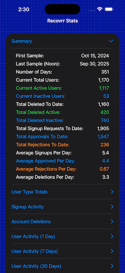

# RECOVRR STATISTICS VIEWER APP

An iOS app designed to read and interpret the anonymized logfile generated by the server component of the Recovrr.org iOS app.

## Overview

The app is a very simple, one-screen [SwiftUI](https://developer.apple.com/swiftui/) app, displaying statistics as a table (summary), or simple bar charts.

It reads [the Recovrr.org app stats file](https://recovrr.org/recovrr/log/stats.csv) (described below), does some interpretation, and allows the user to view a historical overview of the Recovrr.org app's user population, and administrative action.

Everything is completely anonymized. No indvidual user or administrative information is stored or accessible.

| Figure 1: The App (Light Mode) | Figure 2: The App (Dark Mode) |
| :-: | :-: |
|  |  |
| Figure 3: The Summary Screen (Light Mode) | Figure 4: The Summary Screen (Dark Mode) |
|  |  |

## The Stats File

File URL: https://recovrr.org/recovrr/log/stats.csv

The file is a "snapshot" [CSV](https://en.wikipedia.org/wiki/Comma-separated_values) log of a system that has users logging into a central server.

The file is generated on the server end, reflecting user status and administrative actions, with snapshots taken every 12 hours, at midnight (00:00:00), and noon (12:00:00), server time (East Coast US).

Users of the Recovrr.org app can have a location (long/lat), associated with their account. It is possible for them to not select a location. If they do have a location, it is possible for them to hide their location from other users.

All the statistics are anonymized and aggregated. Every 12 hours, a new row is appended to the end of the CSV file.

The Recovrr.org system has a "gatekeeper" administrator, that reviews and approves (or rejects) signup requests.

Users request a signup from the Recovrr.org app, and administrators are notified, when a signup request is made.

Unless a signup is approved, the user cannot log in.

Once a signup has been approved, the user is considered a "New User," until they have logged in, at least once. At that time, they are considered an "Active User."

"New Users" have limited discoverability by other users of the Recovrr.org app.

### User States

These are the following basic states for users (or potential users) of the system:

- #### Open Signup Request
    A potential user has requested an account for the system, and a signup request has been added to the end of a queue.
    An administrator must either approve or reject the signup request.

- #### Approved Signup Request
    An administrator has approved a signup request.
    This means that a new user has been added to the system, and the request has been removed from the signup request queue.

- #### Rejected Signup Request
    An administrator has rejected a signup request.
    The request is removed from the signup request queue, and no new user is added to the system.

- #### New User
    This is a new user that has been created in response to an approved signup request.
    The user has not yet logged into the system, but has been sent an email, with their login details.
    A new user has 30 days from approval, to log in.
    Otherwise, their account may be deleted by an administrator.

- #### Active User
    This is a user that has logged in at least once, after approval.
    We keep track of their last login.
    An active user must log in once a year (or more frequently).
    Otherwise, their account may be deleted by an administrator.
    Active users can delete their own accounts, which completely removes them from the system.
    We do not track these deletions, but they can be inferred, from the totals in the file.

### Column Legend

These are the actual CSV columns in the file. All values are positive integers.

- #### sample_date
    This is the date the sample was taken, in UNIX Epoch Time (Seconds since 1970-01-01 00:00:00).

- #### total_users
    This is the current total of active and new users on the system.
    This does not include signup requests. It is a current (non-cumulative) total.

- #### new_users
    This is the current total of new users on the system. It is a current (non-cumulative) total.
    It does not include signup requests.
    New users have had their signup request approved, but have never logged in, since having it approved.
    > NOTE: In order to calculate active users (users that have logged in, at least once), simply subtract new_users from total_users.

- #### never_set_location
    This is the current total of users (both active and new) that have never set a location.
    It is a current (non-cumulative) total.
    This is different from hiding their location; In which case, there is no location at all. 

- #### total_requests
    This is the total number of requests for signups (open, approved, or rejected).
    It is a cumulative total.

- #### accepted_requests
    This is the total number of requests for signups That have been approved by an administrator.
    It is a cumulative total.

- #### rejected_requests
    This is the total number of requests for signups That have been rejected by an administrator.
    It is a cumulative total.

- #### open_requests
    This is the current (non-cumulative) total of signup requests that exist on the signup request queue (have yet to be addressed by an administrator).

- #### active_1
    This is the total number of active users that have logged in at least once, within the last 24 hours.

- #### active_7
    This is the total number of active users that have logged in at least once, within the last 7 days.

- #### active_30
    This is the total number of active users that have logged in at least once, within the last 30 days.

- #### active_90
    This is the total number of active users that have logged in at least once, within the last 90 days.

- #### active_avg
    This is a simple average of the time since last login, for active users (in days).

- #### deleted_active
    This is the cumulative total of active users that have been explicitly deleted by an administrator.

- #### deleted_inactive
    This is the cumulative total of new users that have been explicitly deleted by an administrator.

